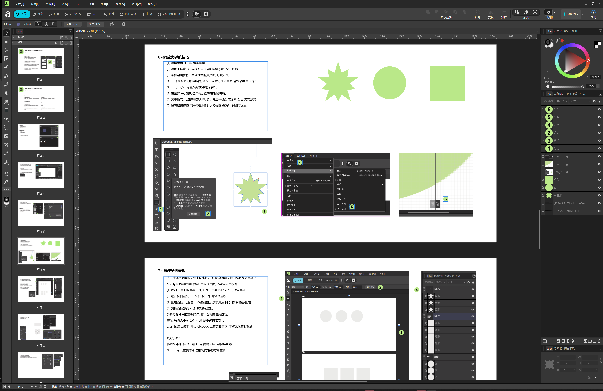

# Affinity 3 簡介
- 下載/安裝 : https://www.affinity.studio/
- 中文社群 : https://www.facebook.com/groups/affinity.af
- 文件更新日期 : 2025/12/1

## 範例檔案說明
我跟著Affinity with Dansky的影片操作, 目前做完了第1~30集。
因為Affinity有很好的多頁面功能, 我就把它當成PowerPoint來用了。
每個.af檔大約10個單元, 內容為:
- 每頁: 1920x1080像素, 有該集的: 中文簡述, 相關介面的中文版截圖指示.
- 還有該單元適合的: 圖形, 相片, 文字範例, 直接放在頁面上
- 您可一邊看著Dansky的影片, 一邊以我準備的檔案操作

[範例檔路徑](./af-samples/)
- 認識Affinity-01.af : 影片1~10
- 認識Affinity-11.af : 影片11~20
- 認識Affinity-21.af : 影片21~22
- 認識Affinity-23.af : 影片23~30

[整包下載.ZIP(約80MB)](https://github.com/yiming/affinity-af/releases/download/V1.0/affinity-af-1.0.zip)

## 優質Youtube影片及頻道
Affinity歷史有10年以上, 在國外早有穩定用戶群, 雖然比例不高, 但也不可忽視。
用於包含印刷等設計領域也很成熟, 網頁功能也相對完整。
只是在這之前, 在中文世界幾乎沒有公開的介紹, 希望未來能更為大眾認識

### Affinity with Dansky
https://www.youtube.com/@affinitytilde
- 英文頻道, 知名設計Youtuber Dansky為Affinity 3特別開的新頻道
- 影片產量很大, 大都很短, 適合輕鬆的熟悉環境
- 沒有太多的設計範例, 以功能認識為主

### Affinity Tilde
https://www.youtube.com/@affinitywithdansky
- 英文頻道, 也是為Affinity 3專門開的頻道
- 內容看來頗為整齊, 影片數也很多, 應該也有心長期經營

### 忙碌的汤姆_BusyTom
https://www.youtube.com/@busy_tom
- 簡體的中文頻道, 內容還不錯, 畫質稍糊
- 有5則以上的Affinity 3中文影片, 長度也都很短。

### PAPAYA 電腦教室 - Affinity 專業設計軟體「永久免費」！快速上手
https://www.youtube.com/watch?v=SY5r4rM8JGk
- 我很喜歡的PAPAYA 電腦教室, 也推出了24分鐘的Affinity 3 介紹影片
- 影片長度剛好, 可以一次認識所有的Affinity主要功能。
- 他的影片一向製作精緻, 節奏明快, 本篇也不例外。
- 不過他不會針對單一主題長期經營, 以多元化為主。